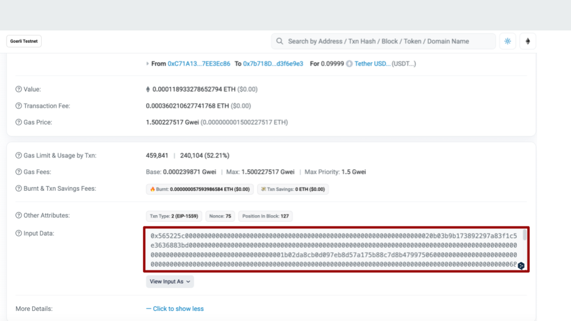

# Slash Extention : キャンペーン別スコアリング
  
 

### 開発スコープ
| 今回開発 | 今後追加開発したい機能 | 
| --- | --- |
| ・最低限の決済データ送信(金額/トークン/決済者) | ・送信するデータの拡大(決済内容の分類 等) <br>・分析用ダッシュボード(時間別KPI/KPIのカスタマイズ(UU/金額/決済数 等)) |

---
## 開発成果物
### ディレクトリ構造
```
├── Contract-Payment    :　決済データ送金コントラクト(今回提出する対象)
│   ├── artifacts
│   ├── cache
│   ├── contracts
│   │   ├── interfaces
│   │   ├── libs
│   │   ├── ScoreTxExtension.sol : 処理部分
│   ├── scripts
│   ├── test
│   └── typechain-types
├── DemoFrontend        
│   ├── python-script   : 動作確認用スクリプト
│   └── thirdweb-app    : 動作確認用Webサイト
└── Doc
```
### 機能詳細 - 決済内容の送信
#### 実行部分
所定のコントラクトを介して決済の情報を書き込む
```
function scoreTransaction (
        address _sender,
        address _txOrigin,
        address _receiveToken, 
        uint256 _amount,
        bytes calldata _reserved
    ) internal {
        // 書き込むメッセージを定義する
        bytes memory scoreMsg = abi.encodePacked(
            _sender,
            _txOrigin,
            _receiveToken,
            _amount,
            _reserved
        );
        // noteに上記メッセージを含んだ状態で0ethの送金txを実行する
        (bool success, ) = (scoreBoard).call{
            value: 0 wei, 
            gas: 30000
        }(scoreMsg);
        require(success, "Failed to send ether");
    }
```

#### 実際の送信Tx
Internal Transactionにて確認

※　トランザクションID：0x66112778be8f71a841ffe3b418c58145dd24b46b978091cd31c9e2b2240c8fdb


