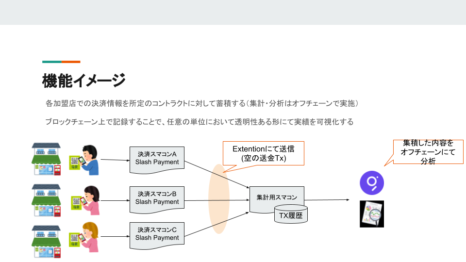
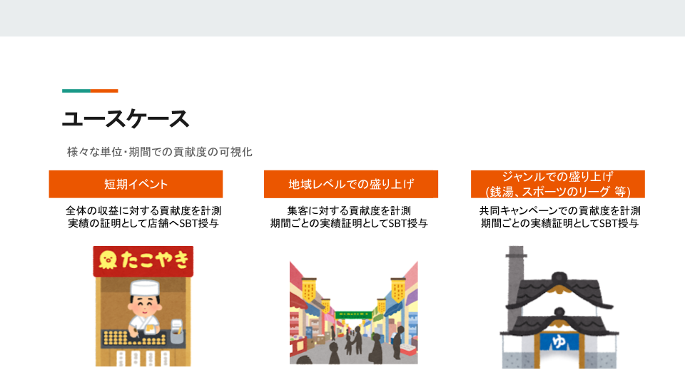

# Slash Extention : キャンペーン別スコアリング

## 機能概要
  
  
### ユースケース
 

### 開発スコープ
| 今回開発 | 今後追加開発したい機能 | 
| --- | --- |
| ・最低限の決済データ送信(金額/トークン/決済者) | ・送信するデータの拡大(決済内容の分類 等) <br>・分析用ダッシュボード(時間別KPI/KPIのカスタマイズ(UU/金額/決済数 等)) |

### 機能詳細 - 決済内容の送信
---
## 開発成果物
### ディレクトリ構造
```
├── Contract-Payment    :　決済データ送金コントラクト(今回提出する対象)
│   ├── artifacts
│   ├── cache
│   ├── contracts
│   │   ├── interfaces
│   │   ├── libs
│   │   ├── ScoreTxExtension.sol : 処理部分
│   ├── scripts
│   ├── test
│   └── typechain-types
├── Contract-Receive    : 決済データの受け口（デモ用）
├── DemoFrontend        
│   ├── python-script   : 動作確認用スクリプト
│   └── thirdweb-app    : 動作確認用Webサイト
└── Doc
```
### 処理内容の解説
